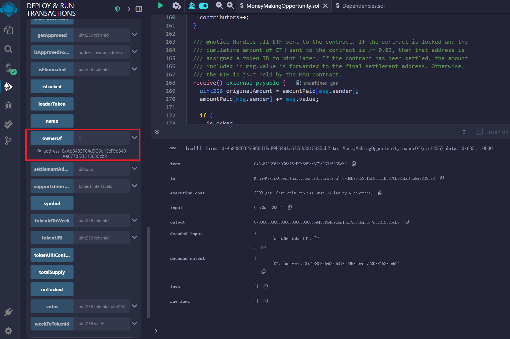
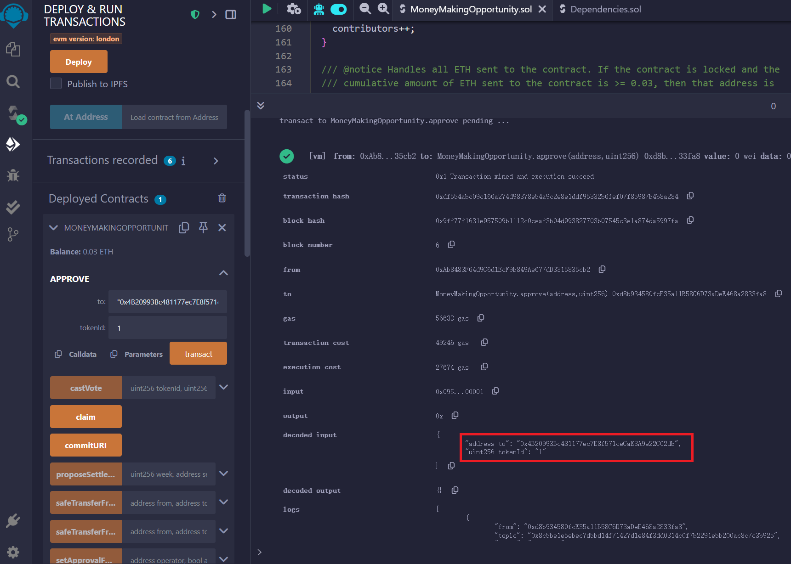
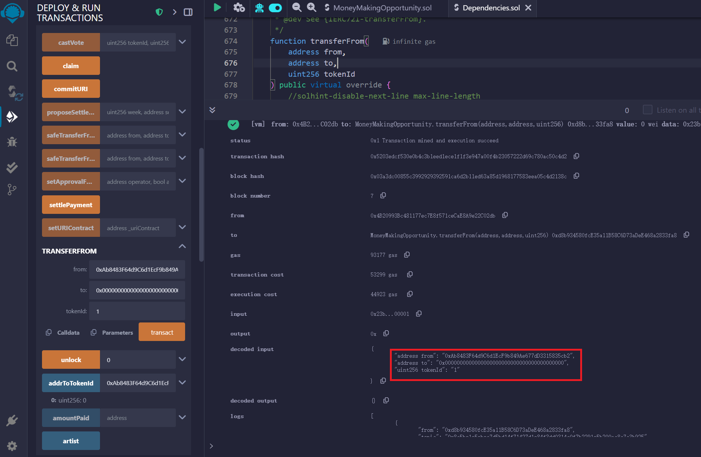

# ERC721 `_transfer` Missing Zero Address Check Leads to Irrecoverable NFT Loss

- **NAME**: [Money Making Opportunity (MMO)](https://steviep.xyz/moneymakingopportunity/)
- **ADDRESS**: [0x41d3d86a84c8507A7Bc14F2491ec4d188FA944E7](https://etherscan.io/address/0x41d3d86a84c8507a7bc14f2491ec4d188fa944e7#code)
- **CVE ID:** Pending
- **CWE:** CWE-754: Improper Check for Unusual or Exceptional Conditions

---

## Overview

The ERC721 `_transfer` implementation in `Dependencies.sol` lacks a validation to ensure that the `to` address is not the zero address (`address(0)`). This omission allows an attacker (approved caller) or user (token owner) to transfer NFTs to the zero address by invoking a transfer with `to == address(0)`, resulting in permanent asset loss with no recovery path. This behavior violates the ERC721 standard, which requires that transfers to the zero address be disallowed except in explicit burn scenarios.

---

## Core Function
```solidity
    function _transfer(address from, address to, uint256 tokenId) internal virtual {
        require(ERC721.ownerOf(tokenId) == from, "Transfer not own");
        _beforeTokenTransfer(from, to, tokenId);
        _approve(address(0), tokenId);
        _balances[from] -= 1;
        _balances[to] += 1;
        _owners[tokenId] = to;

        emit Transfer(from, to, tokenId);
    }
```
---

## Exploit

- User (token owner) address: 0xAb8483F64d9C6d1EcF9b849Ae677dD3315835cb2
- Attacker (approved caller) address: 0x4B20993Bc481177ec7E8f571ceCaE8A9e22C02db
- (These addresses are examples and not actual addresses involved in any known exploit)

1. The user owns an NFT with `tokenId = 1`


Figure 1. The user is the current owner of the NFT with `tokenId = 1`.


2. The attacker obtains approval to transfer the user's NFT


Figure 2. The user calls the `approve` function, granting the attacker permission to transfer their NFT.


3. The attacker transfers the NFT to the zero address


Figure 3. The attacker calls the `_transfer` function with `to == address(0)`, sending the NFT to the zero address.

4. Outcome:
- The NFT becomes permanently locked at the zero address (address(0)).
- No recovery mechanism exists within the contract, resulting in irreversible asset loss.

---

## Impact
- **Potential user financial loss:** Users may lose NFTs due to malicious transactions or unintentional misuse.
- **Irrecoverable asset loss:** NFTs transferred to the zero address are permanently inaccessible.
- **ERC721 standard violation:** Transfers to the zero address without explicit burn violate EIP-721 requirements.
- **Indexing and ecosystem inconsistencies:** Indexers like The Graph or OpenSea may interpret the transfer as a burn, but the contract state may not align due to the missing burn logic.

---

## Remediation
Add the following check at the start of the `_transfer` function:

```solidity
    require(to != address(0), "ERC721: transfer to the zero address");
```
---

## References
- [ERC721 Standard (EIP-721)](https://eips.ethereum.org/EIPS/eip-721)
- [CWE-754: Improper Check for Unusual or Exceptional Conditions](https://cwe.mitre.org/data/definitions/754.html)
- [OpenZeppelin ERC721 Reference Implementation](https://github.com/OpenZeppelin/openzeppelin-contracts/blob/master/contracts/token/ERC721/ERC721.sol)
